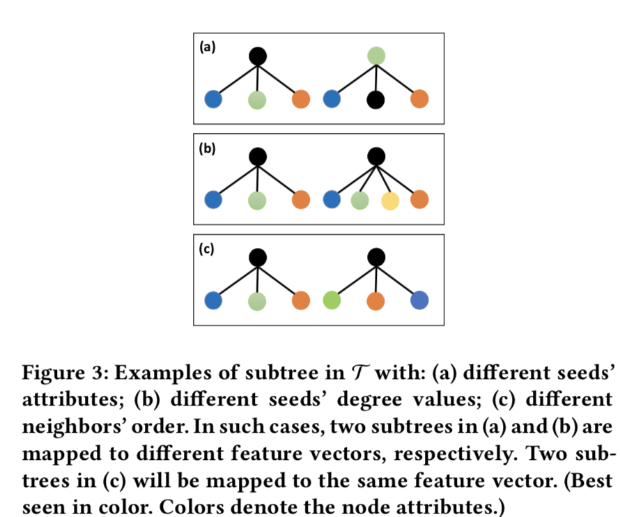
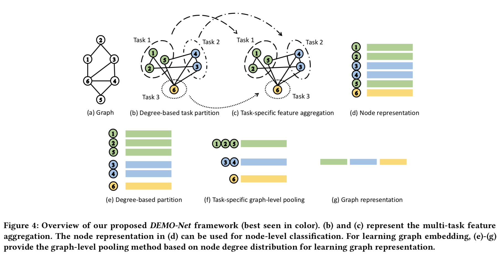
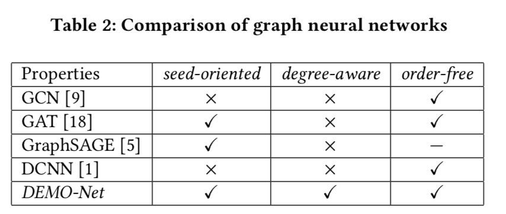

- 原文链接见[此处](https://dl.acm.org/citation.cfm?doid=3292500.3330950)

# Abstract
> 图结构数据广泛应用在很多重要学科，受网格状数据深度学习的启发，gnn被提出去学习点级或图级的表征

> 现有GNN有以下三个限制
> 1. 对于图卷积如(`seed-oriented, degree-aware, order-free`)等特性的分析有限。
> 2. 区分结构感知(`structure-aware`)的节点邻域时，节点度特异(`degree-specific`)的图结构没有被显式表达在图卷积中(?)
> 3. 图级上的池化机制，其理论解释尚不清楚

基于Weisfeiler-Lehman的图同构测试(递归识别1跳邻接结构) 提出通用degree-speific gnn——`DEMO-Net`。

为了显式地捕获集成有点属性的拓扑结构，文章认为图卷积应该具有三个属性:(`seed-oriented, degree-aware, order-free`)。为此，提出了多任务图卷积，其中每个任务分别代表对具有不同特定度值节点的表征学习，从而保持了`degree-specific`的图结构。文章作者设计了两种多任务学习方法:度比权重法和图卷积的哈希函数法。

此外，我们还提出了一种新的图级池化/读出方案，该方案位于`degree-specific`的希尔伯特核空间(？)中，这是可证明的。

# Introduction

## 背景
为了充分利用图结构数据中丰富的信息，从节点/边缘属性和图的拓扑结构两方面学习有效的节点或图表示是非常重要的。

为此，近年来，由于网格结构数据(如图像、视频、语言等)的深度学习体系结构的成功，许多图神经网络模型被提出。这些方法背后的一种直觉是，**拓扑结构和节点属性**可以通过**递归聚合和压缩来自本地邻域的连续特征向量**来集成在**端到端培训体系结构**中

gnn的一个关键部分是**图卷积**(或特征聚合函数)，它从节点的局部邻域中聚合信息并转换成向量。gnn用拉普拉斯平滑或注意力机制将节点属性与图结构信息集成，并学习如何在低维度特征空间表征节点，在此特征空间中邻近节点共享相似的表征(即数据接近)。此外，为了学习整个图的表征，研究者提出了**图级的池化(汇聚)机制**(`graph-level pooling schemes`)。它能将节点的表征压缩到一个全局的特征向量。gnn学习的节点或图表示在许多下游图挖掘任务中，如节点分类、图分类等，都有较好的效果。

## 现有GNN局限
- 学习节点时，对图卷积中那些可以指导网络设计的特性分析十分有限。
- 为了保持节点的邻近性，图卷积应用了一种**特殊形式的拉普拉斯平滑**，它简单地混合了来自节点邻域的属性。这将导致学习表示的特定于度(degree-specific)的图结构信息的丢失。如下Fig1。此外用于提高模型效率的邻域子采样方法显著降低了度特异性图结构的识别度。

<!--   -->
>节点4和节点5在结构上不同，但是由于使用现有方法的一阶节点邻近性，它们将映射到类似的表示形式
- 关于图级pooling方案的理论解释基本缺失。

## DEMO-Net 核心思想

DEMO-Net是一种通用的图神经网络模型，模型在学习节点和图表示的同时考虑了**度相关的图结构**

受Weisfeiler-Lehman图同构测试，图卷积需要有三个特性：`seed-oriented, degree-aware, order-free`，以便将不同邻域的图结构映射到不同的特征表示。

> 如Fig1中，节点2、8有相似的子树结构(根节点及其1跳的邻点组成)。他们在特征空间应该接近。相反节点4、5的结构则不同，他们在图中所表征的角色不一样，因此映射到特征空间后，他们不应该互相靠近。

DEMO-Net是一个degree-specific的图网络，**对度相同的节点共享相同的卷积**。这个GNN也可以看作是一个多任务特征学习，每个任务表示如何表征不同度值的节点。

DEMO-Net还提供了一个图等级上的池化机制来学习图的表征。论文从理论上证明了模型所学习的图表征存在于一个由特定于度的weisfeler - lehman图核诱导的可复制核Hilbert空间(RKHS)(`a Reproducing Kernel Hilbert space (RKHS) induced by a degree-specific Weisfeiler-Lehman graph kernel`)

## Graph Isomorphism Network 图同构网络
`GIN`的工作与本文相似。使用与多层感知器相关联的sum-aggregator作为邻域-单射(neighborhood-injective)图卷积，以此将不同节点邻域映射到不同的特征表示上。

`GIN`依赖于多层感知器的通用逼近能力，度相关的图结构在卷积中是隐式表达的。

## 文章主要贡献
- 从Weisfeiler-Lehman图同构检验角度出发对GNN进行理论分析，从而根据`seed-oriented, degree-aware, order-free`设计图卷积。
- 基于度相同的节点有相同的图卷积，提出通用GNN框架DEMO-Net。degree-specfic多任务图卷积被提出用于学习点特征，同时提出一个图级池化机制来学习图的表征。（可以证明出这个表征在一个degree-specific Hilbert 核空间）
- 使用基准数据集进行实验，结果证明了模型的有效性及高效性。

# Related Work

## 节点分类
现有的大多数GNN都是通过**递归地将局部邻域的连续特征向量以端到端的方式聚集来学习节点表示**的。可看作`MPNN`(`message passing neural network`)的实现，GNN的特征聚集可以看作信息message在局部邻域的传递。不同于谱域上的方法，MPNN风格的网络侧重于通过在空间节点域上直接卷积来提取空间的拓扑信息。

GCN通过邻域的聚合函数来定义卷积运算，基于同样的启发，很多GNN被提出，他们分别用注意机制、均值、max等来替换聚合函数。

这些GNN架构多数启发于网格结构数据(欧氏数据，即矩阵)的深度学习，很少有理论分析可以解释架构的高性能，也很少分析可以被用来指导新方法的设计。到目前为止，已经有人提出一些工作来解释为什么GNN可行。**GCN的卷积是图上的拉普拉斯平滑的一种特殊形式，它解释了许多卷积层带来的过平滑现象。**

Lei[^1]等人指出由GNN生成的图级表征存在于一些常用图核的RKHS(`Reproducing Kernel Hilbert Space `)中。同时指出，在区分图结构的能力上，基于一维聚集的GNN最多只能与WL同构测试(`Weisfeiler-Lehman (WL) isomorphism test`)相当。

与已有的图神经网络研究工作相比，本文设计了一种**基于WL同构检验的图节点邻域结构的度特异性图卷积**。这与现有的工作有很大不同，现有的工作侧重于在特征空间中保留节点的邻近性，从而导致局部图结构的丢失。
## 图分类
图级池/读出机制旨在从图级分类任务的节点表示中学习整个图的表示。均值/max/和函数由于其计算效率和有效性而被广泛使用。

图级池化的一个挑战是**保持节点顺序的不变性**。

最近，许多GNN模型被提出，它们将节点表示学习和图级池化结合在一个统一的框架。与图核方法利用特定知识或随机游走的特性直观提取图特征或定义图相似度不同，GNN通过端到端的训练体系结构，自动学习图的表示形式，将节点属性与其拓扑信息集成在一起。

然而，很少有人在图表示学习中考虑度相关的图结构。本文提出的graph-specific的图级池化方法就是为了解决这个问题，**根据度的值压缩学习到的节点表示**。

# Preliminaries
## 符号

<!--   -->
- $X\in \mathbb{R}^{n\times D}$ 每行为 $x_v$ 对应每一点的属性
- $A\in \mathbb{R}^{n\times n}$ $A_{ij}$是点$i,j$的相似性
## 问题定义
本文主要研究对象为无向属性图/网络。

### 节点级表征学习
输入：
- 属性图$G =(V,E)$
- 邻接矩阵$A \in \mathbb{R}^{n \times n}$
- 点属性矩阵 $X \in \mathbb{R}^{n \times D}$
- 被标记了的训练用点集合 $\{x_v,y_v\}_{v \in \mathcal{I}_G}$

输出：
- 点在d维嵌入空间内的一个特征表示$e_v \in \mathbb{R}^d$，若点的局部邻域结构不同，则表征在嵌入空间能够很好地被区分。

### 图级表征学习
输入：
- 带属性的图集合$\mathcal{G}=\{G_i\}^t_{i=1}$
- $t = |\mathcal{G}|$ 即图集合的数量
- 邻接矩阵$A_i \in \mathbb{R}^{n_i \times n_i}$
- 点属性矩阵 $X_i \in \mathbb{R}^{n_i \times D}$
- 被标记了的训练用图集合 $\{G_i,\hat{y}_i\}_{i \in \mathcal{I}_\mathcal{G}}$

输出：
- 图$G_i$在d维嵌入空间内的一个特征表示$g_i \in \mathbb{R}^d$，若图的拓扑结构不同，则表征在嵌入空间能够很好地被区分。

## Graph Neural Network
大部分GNN框架遵守1维WL图同构测试，从WL test的角度来看，这些GNN在特征聚合的迭代中主要分为以下步骤：
- 特征初始化/标记初始化(`label initialization`)，根据原始属性向量$x$来初始化点特征
- 邻域识别/`multiset-label determination`，决定节点把哪些邻点作为局部邻域，并从中收集信息
- 邻点排序/`multiset-label sorting`，对选取的邻点进行排序
- 特征聚合/标记压缩`label commpression` 通过压缩聚合得来的特征向量来更新点的特征(隐态)
- 图级池化汇聚/`graph representation` 总结所有节点的节点向量来形成一个全局图表征

文章还对比了几个GNN框架，他们的共享第一、二个步骤，而对于第四个步骤的特征聚合则采取了不同的做法
- GCN `Graph Convolutional Network`
$$h^k_v = \sigma(\begin{matrix}
\sum_{u\in\{v\} \cup N(v)}\hat{a}_{vu}W^kh_u^{k-1}
\end{matrix})$$
$\hat{A}=(\hat{a}_{vu})\in \mathbb{R}^{n\times n}$ 对应加入自循环的邻接矩阵的重新规格化后的形式。$W^k$对用第k层可训练的权重矩阵
- GAT `Graph Attention Network`
$$h^k_v = \sigma(\begin{matrix}
\sum_{u\in\{v\} \cup N(v)}a_{vu}W^kh_u^{k-1}
\end{matrix})$$
$a_{uv}$是自注意力的分数即“对于点v的特征聚合来说，点u特征的重要程度”可以看出GCN是GAT的一种特殊形式
- GraphSAGE
$$\begin{aligned}
  h_{N(v)}^k = \mathrm{AGGREGATE}_k(\{h_u^{k-1}|u\in N(v))\}) \\
  h_v^k = \sigma(W^k · \mathrm{CONCAT}(h_v^{k-1},h_{N(v)}^k))
\end{aligned}$$
其中$\mathrm{AGGREGATE}$可用平均/最大值/LSTM聚集器，LSTM将邻点视为有顺序的序列，对于无序邻点则用随机排序。

对于以上GNN提出了几个问题：
- 除了lstm聚合器，其他的聚合机制对任意的邻点顺序不敏感，即效果相仿
- 对于第k层的输出特征可以看作一个子树的结构，如下图Fig2
- 随着网络层数加深，点的特征将越来越接近且不可区分(过平滑)
- 很少有理论去分析以上问题的原因来指导后续GNN的设计，即节点度以及邻点顺序(子树的结构)对点特征计算的影响，

<!--   -->

针对现有GNN的理论缺陷以及Fig2的描述，设计了一个显式保留有度相关子树结构的图卷积。

# DEMO-NET 定义
## 一些定义与引理
- 子树集合定义：$\mathcal{T}=\{(h_v,h_{N(v)})\}$
- 结构相似子树(`Structurally Identical Subtree`)：$\mathcal{T}$集合下的两棵子树如果满足除了邻点顺序不一致，其他性质均相同则称他们结构相似
- 特征聚合可以简单定义：$h_v^k=f(\{h_v^{k-1},h_u^{k-1}|u\in N(v)\})$

> 引理 4.2: 如果映射函数$f:\mathcal{T} \rightarrow \mathbb{R}^d$是**单射**的，当且仅当WL图同构检验确定两个点(u、v)的子树不满足"结构相似"时，v和u的习得特征才会不同。

> 引理 4.3: 如果映射函数$f:\mathcal{T} \rightarrow \mathbb{R}^d$是**单射**的，该函数同时也是聚集函数(图卷积)，则满足以下特性，参考Fig3
>  - seed-oriented:如Fig3(a),如果根节点不一致则$f(\{h_i^{k-1},h_u^{k-1}|u\in N(i)\})\not= f(\{h_j^{k-1},h_u^{k-1}|u\in N(j)\})$
>  - degree-aware:如Fig3(b),如果根节点度不一致则$f(\{h_i^{k-1},h_u^{k-1}|u\in N(i)\})\not= f(\{h_j^{k-1},h_u^{k-1}|u\in N(j)\})$
>  - order-free 如Fig3(c),如果子节点的顺序不一致则$f(\{h_i^{k-1},h_u^{k-1}|u\in N(i)\}) = f(\{h_j^{k-1},h_u^{k-1}|u\in N(j)\})$

<!--   -->
## 点特征学习
基于以上对图卷积特性对要求，则特征聚合可以如下表达
$$\begin{equation}
  h_v^k = f_s(h_v^{k-1}) \circ f_{deg(v)}(\{h_u^{k-1}|u\in N(v)\})
\end{equation}$$

- $f_s$，$f_{deg(v)}$是种子(子树根节点)相关和度相关的映射函数，如果他们是单射的则满足seed-orientd、degree-aware，如果是对称的($f(x_1,x_2)=f(x_2,x_1)$)则满足order-free，映射函数的存在性见[原文](https://dl.acm.org/citation.cfm?doid=3292500.3330950)附件处证明
- $\circ$ 表示向量拼接

$$\begin{equation}
  f_s(h_v^{k-1}) = \sigma(W_0^kh_v^{k-1})
\end{equation}$$

- $W_0^k$在第k层卷积内由所有节点共享的可训练权重矩阵
- $\sigma(·)$是非线性激活函数

$$\begin{equation}
   f_{deg(v)}(h_{N(v)}^{k-1}) = \sigma(\begin{matrix}\sum_{u\in N(v)}(W_g^k + W^k_{deg(v)}h_u^{k-1})\end{matrix}) 
\end{equation}$$
- $W_g^k$在第k层卷积内由所有节点共享的全局可训练权重矩阵
- $W_{deg(v)}^k$在第k层卷积内度相关对应的权重矩阵

对于大规模图中度的取值范围很大，会对多任务的学习造成困难(**不同的度对应不同的任务，度选择越多任务越多，学习越复杂，效率越低**)，为此引入了哈希核(又名`feature hashing` 或`hash trick`)

哈希函数及对应核函数如下
$$\begin{equation}
   \phi_i^{\xi_1,\xi_2}(x) = \sum_{j:\xi_1(j)=i}\xi_2(j)x_j
\end{equation}$$
$$\begin{equation}K_{\phi}(x,x')=\langle x,x'\rangle_\phi=\langle\phi^{\xi_1,\xi_2}(x),\phi^{\xi_1,\xi_2}(x')\rangle\end{equation}$$

- 可以理解哈希是对一个特征$x$降维到维度$m$的过程
- $\phi_i$表示降维后的第i维的值，$\phi(x)$则是用$x$降维后的对应向量
- 哈希函数$\xi_1:\mathcal{N}\rightarrow \{1,...,m\}$ $\xi_2:\mathcal{N}\rightarrow \{1,-1\}$
- 可见核函数是无偏的(`unbiased`) 即核函数的数学期望满足$E_{\phi}[\langle x,x'\rangle_\phi]=\langle x,x'\rangle$，对于$W^k_{deg(v)}$的某一行向量$w^k_{deg(v)}$则可以推出$E_{\phi}[\langle w^k_{deg(v)},h^{k-1}_u \rangle_\phi]=\langle w^k_{deg(v)},h^{k-1}_u\rangle$

$f_{deg(v)}$则可以如下表达
$$\begin{equation}
   f_{deg(v)}(h_{N(v)}^{k-1}) = \sigma(\begin{matrix}\sum_{u\in N(v)}W^k(\phi_g(h_u^{k-1})+\phi_{deg}(h_u^{k-1}))\end{matrix}) 
\end{equation}$$

- $W^k = \phi_g(W^k_g) + \sum_{deg}\phi_{deg}(W^k_{deg})$ 可共享于所有节点，而$\phi_{deg}(·)$则根据节点度的不同而改变

多任务学习中的所有任务有一部分是共享的，如Fig3(b)中**子树结构不同，但是其部分叶子节点是相同的，应共享部分信息**，所以在计算中同时采用$W^k_g$,$W^k_{deg}$能够同时学习共享部分以及不共享部分(度不同而不同的结构)的信息
## 图特征学习
GNN层数越深，则点的表征能获得其局部邻域越高阶的拓扑信息，基于这个思想，图的表征则由不同度的点的特征的和拼接而成，(看不懂可先忽略这里的断句)具体如下：

对在不同层GNN的图集合表示为$\{G_0,G_1,...G_k\}$，$G_0$表示原始的图，$G_k$则是第k层聚集后的图
$$\begin{equation}
  h_{G_k}=\mathrm{CONCAT}(\{\sum_{v\in V}h_v^k·\delta(deg(v),d)\}|d\in degree(G))
\end{equation}$$

- $\delta(a,b) = \begin{cases} 
1,  & \mbox{if a=b} \\
0, & \mbox{if a}\not= \mbox{b}
\end{cases}$

如之前讨论，$G_k$捕捉了k跳(k阶)邻域的拓扑信息，为了把所有子树(即不同度)的结构信息，我们将$\{G_0,G_1,...G_k\}$的特征拼接起来：
$$\begin{equation}
  h_{G}=\mathrm{CONCAT}(h_{G_k}|k=0,1,..,K)
\end{equation}$$


<!--   -->

对比现有图级池化机制及WL子树的核，文章有提出了`degree-specific WL kernel`：
$$\begin{aligned}
  K_{DWL}(G_k,G_k')&=\langle \phi_{DWL}(G_k),\phi_{DWL}(G_k')\\
  &=\sum_{v\in V}\sum_{v'\in V'}\delta(deg(v),deg(v'))·\langle h_v^k,h_{v'}^k \rangle
\end{aligned}$$

- $\phi_{DWL}(G_k)=[c(G_k,d_1)\circ...\circ c(G_k,d_{max(degree(G_k))})]$
- $c(G_k,d_i)=\sum_{v\in V}h_v^k·\delta(d_i,deg(v))$
- 对于激活函数$\sigma(·)$同样有一个映射函数$\phi_{\sigma}(·)$满足$\sigma(\mathbf{w^Tx})=\langle\phi_{\sigma(\mathbf{x})},\psi(\mathbf{w})\rangle$,$\psi(\mathbf{w})$由$\mathbf{w}$所构建

则结合上述可以得出定理4.5,证明可见原文附件处

> 定理4.5：对于一个`degree-specific WL kernel`，等式(8)中图的表征$h_G$ 属于核$K_{\sigma,DWL}(·,·)$的再生核希尔特空间(`RKHS,Reproducing Kernel Hilbert Space`)中

$$\begin{equation}
  K_{\sigma,DWL}(G_K,G'_K)=\langle \phi_{\sigma}(\phi_{DWL}(G_k)),\phi_{\sigma}(\phi_{DWL}(G'_k))\rangle
\end{equation}$$

基于和/平均的图级池化机制所在空间对应核如下：
$$
\begin{aligned}
  K_{MWL}(G_k,G'_k)=\sum_{v\in V}\sum_{v'\in V'}\langle h_v^k,h_{v'}^k \rangle
\end{aligned}
$$

WL子树核如下：
$$
\begin{aligned}
  K_{WLsubtree}(G_k,G'_k)=\sum_{v\in V}\sum_{v'\in V'}\delta(h_v^k,h_{v'}^k)
\end{aligned}
$$

综上，可以看出：
- WL子树核在点属性是连续的时候不能用于测量图的相似性
- 对比等式(9)(11),文章中的图级表征位于**度相关(degree-specific)的核空间**
## Discussion

根据引理4.3，可知当聚合函数是单射对称的时候，可同时满足`seed-oriented, degree-aware, order-free`的特性。文章还对比了其他GNN的这些特性，见Table2。DEMO-Net同时满足所有特性，在节点、图表征学习中显式地保存有邻点结构的信息，且**DEMO-Net的时间复杂度与图的节点数、边数线性相关**，证明见原文。

<!--   -->
# Experimental 

主要列出了4个问题，比设计了相应的实验验证，本文只针对讲述模型的思想，实验步骤、过程、详细结果见原文。
1. 提出的DMEO-Net在节点分类上是否比最新的GNN有效？
2. 对比结构感知的图嵌入算法，在识别图结构上，DEMO-Net的表现如何？
3. 在图级分类问题上，带有度相关(degree-specific)信息的DEMO-Net的表现如何？
4. DEMO-Net中度相关的卷积在学习点表征上是否有效？
# 辅助阅读

- [维基百科-feature_hahing](https://en.wikipedia.org/wiki/Feature_hashing)
- [再生核希尔伯特空间RKHS](https://zhuanlan.zhihu.com/p/29527729)
- [核方法](http://sakigami-yang.me/2017/08/13/about-kernel-02/)
- [WL同构测试](https://www.slideshare.net/pratikshukla11/graph-kernelpdf)
- [WL同构测试的另一篇介绍](https://www.yidianzixun.com/m/article/0MbO9lLp)

---
[^1]:Tao Lei, Wengong Jin, Regina Barzilay, and Tommi Jaakkola. 2017. Deriving neural architectures from sequence and graph kernels. In ICML.