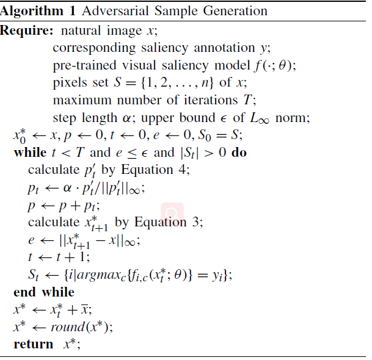
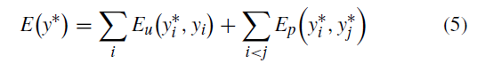
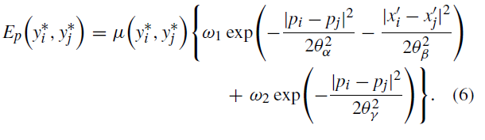

# 精读ROSA

$$e =mc^2$$

---
$$\frac{x+1}{\sqrt{1-x2sdf}}$$

本人首次阅读CV方向论文，部分转有名词翻译存误，见谅

# Abstract
> 在显著物体检测研究有了一定进展的背景下，当前最优秀的预测框架虽有高准确率高效的特点，但依然存在被对抗攻击扰乱的问题。

> 提出ROSA(端对端可训练)提高基于FCN(`Fully convolution network`)的显著物体预测的鲁棒性
> 1. 引入通用噪声破坏对抗扰乱
> 2. 对输入图片加了噪声(`generic noise`)后的图片，学习预测其特征图
> 3. 加入段屏蔽组件，保护图形边界并破坏特殊设置的(`delicate`)对抗噪声
> 4. 加入情境感知的复原组件，通过全局对比度的建模来完善特征图

---

# Introdutction
近年由于CNN的发展，大量数据集下训练的深度CNN在显著物体识别上的应用变得可行。在物体识别方向上主流有两个做法
- 分段标记`segment-wise`：将图像分割成多个区域，同一区域内的像素会有相同的显著分数,随后提取区域的CNN特征来评估显著性
- 像素级标记`pixel-wise`：根据像素不同而标记不同的显著分数，常用FCN架构，输入完整图像并获得密集特征图作为输出，基于端对端的训练使其拥有最优秀的准确率。

## 基于FCN的方法会引出以下问题：
- 端对端的训练使梯度轻易从监督目标传向输入图像，i.e.具体而言，输入图像少许的变化或噪音就会导致特征图的变化这也导致这类模型有被对抗噪音attack的风险。
- 此类密集标记的模型不能显性的模拟出图像不同部分的区别(模型存在不可解释性)，而是隐性的计算像素的显著性，当输入图像被对抗噪声污染后，就无法正确识别出其低级特征以及高层次特征。
- 目前最大的数据集也不过只有几千张图片，数据集缺乏，标注的物体类别也同样十分有限，导致识别的物体大部分都是训练集中出现的，i.e.图像识别的泛化能力不足。过分依赖捕捉到的高层次特征，因此对初级特征很敏感，低级特征被噪声干扰就会严重影响效果

## `segment-wise`级别的标记方法则有较强的鲁棒性。
其对图像中的区分进行了显性的建模，即根据情境、区域等多区域，对区域进行显着性打分。对于不同段，由相同目标计算而来的梯度会冲突(不同区域可能共享同一种情境)。**然而，在实验中对于稀疏标记的模型，因为要评价几百个的分段所以是低效的**

## 为提高密集标记模型的鲁棒性而提出ROSA
- 对抗噪声由BP(`backward propagation`)计算而来，且会生成细长的曲线，只针对神经网络模型
- CNN对通用噪声(`generic noise`)不敏感
- 拥有相同低级特征的相邻像素拥有相似的显着分数

---
## **综上：ROSA对图像加入`generic noise`来破坏对抗噪声，对此适应性地预测出特征图以对抗引入的噪声**
- **分段屏蔽组件**(`segement-wise shielding component`)，在网络前加入，根据低相似性在区域内部随机打乱像素，不易破坏分段的边界，引入`generic`噪声破坏对抗噪声中的结构形式(前文所说的曲线)。
- **情境感知复原组件**(`context-aware restoration component`)，在网络后加入，根据原图片(加入噪声前)的像素值及情境对输出的显着分数进行调整，并行计算提高效率。

---
# Method 实现

## 对抗样本生成




<!-- 

 -->

> 此处latex暂时无法渲染，故只能截图。碍于无法使用latex，算法变量不作详细介绍，只作算法部分说明，若需理解请阅读原文
- 原图每次迭代添加上`lost Function`对当前迭代的梯度使其向`lost function`上升的方向
- 添加ε的误差容错，控制在变化范围内不会使图片无法辨认，容错选择越大，对特征图提取影响越大。
- 扰动p需要进行归一化，并乘上α作为修正的步长

以此得出对抗扰乱的图作为后续输入

## ROSA实现

<!--  -->
巧妙之处：
- 不同于传统反对抗方式，传统方式是通过平滑化等手段尽可能减少对抗噪声的影响。
- 以毒攻毒:加入`generic`噪声去破坏对抗噪声的模式(`pattern`)使其失效
- 将毒排出：加入情境感知组件将特征图复原

## 分段屏蔽组件
CNN对对抗噪声以外的噪声不敏感且容易适应，故可反其道行之加入其它噪声，同时为了减少噪声影响，需先选取超像素，并由聚类实现
>Specifically, k cluster centers in the joint space of color and pixel position are initialized by sampling pixels at regular grid steps. Then, we assign each pixel to the cluster center with minimum distance and update each cluster center as the mean vector of pixels belonging to the cluster, in an iterative way. The iteration ends when L2-norm error between new location and previous location of each cluster center converges.
> 经规则化网格取样像素的颜色、位置初始化聚类中心，离中心最近的像素并入簇中并更新用簇中像素平均向量来更新中心，不断迭代至原中心与新中心的L2范数误差收敛。

**对超像素内部的像素进行打乱以达到引入噪声的目的**，没有选择以平均像素值的方法来平滑化超像素，是为了提供可复原噪声的可能性、且平均的方法**不易让FCN捕获高级语义**，
噪声的引入其实减少了过拟合的问题以及增强数据集的效果。

## 情境感知复原组件
由于对抗干扰所针对的就是卷积窗口的参数，为避开这个问题，恢复组件根据原图像素间的低级相似性来对特征图进行修复、优化，完全基于图的建模，不依赖于CNN架构。由于恢复组件利用全局上下文来细化结果，因此通过一些有限扰动强度的对抗性噪声来改变预测更加困难。
原理则是最下化以下的能量函数

<!--  -->

y*指结果的特征图，而y指原标记的特征图，能量函数本质就是测量粗略计算图与目标图的区别cost，以及图内像素间的cost，越接近的像素理应值越接近则能量函数越小


<!--  -->
其中ω、μ均是由训练学习而来，μ是标签兼容性函数(`label compatibility function`)，用于对参数的标签不一致时的惩罚

## 训练
训练参数可参照原文，不作解释。只作关键部分说明，其中分段屏蔽组件没有参数不作训练，而情感复原组件则需要与核心预训练的FCN一起进行微调，迭代EPOCHs都不超过5，**为提高针对不同对抗干扰的泛化能力，微调的样本不加入对抗样本**

---
# Conclusion
- 文章大量的图片效果以及数据结果，碍于博客篇幅没有一一展示，完全可以通过阅读原文进行查看(链接见参考文献)，也不进行相应的讨论
- ROSA定位更像一个插件、组件，可在已有的FCN模型上进行补充已增加鲁棒性以抵抗对抗干扰。ROSA与FCN无关，而是深度模型以外的预处理以及后处理，即插即用与中间模型依赖不大
- 反其道行之，以毒攻毒，用模型不敏感的噪声去破坏对抗干扰的噪声
---
# References

- Li H, Li G, Yu Y. ROSA: Robust Salient Object Detection Against Adversarial Attacks[J]. IEEE transactions on cybernetics, 2019. Availble: [https://arxiv.org/abs/1905.03434](https://arxiv.org/abs/1905.03434)

- Zheng S, Jayasumana S, Romera-Paredes B, et al. Conditional random fields as recurrent neural networks[C]//Proceedings of the IEEE international conference on computer vision. 2015: 1529-1537. Availble: [https://arxiv.org/abs/1502.03240](https://arxiv.org/abs/1502.03240)

